# #XNAMazes3D

Transcription Markdown de Rapport_MorelA_Caballol.pdf : 

### Programmation des jeux vidéos

#### **Morel Anaïs**

#### **Caballol Cédric**

Rapport projet XNA

**Table des matières : **

**Page 2 - Partie théorique **

**Page 4 - Partie détails code**

**Page 12/13 - Diagramme de classe complet **

## I - Partie theorique - travail en amont 

**a)Organisation**

Pour ce projet, on avons privilégié un méthode AGILE et mis en place des listes de tâches : 

Pour chaque semaines, nous nous sommes repartis le travail à effectuer.

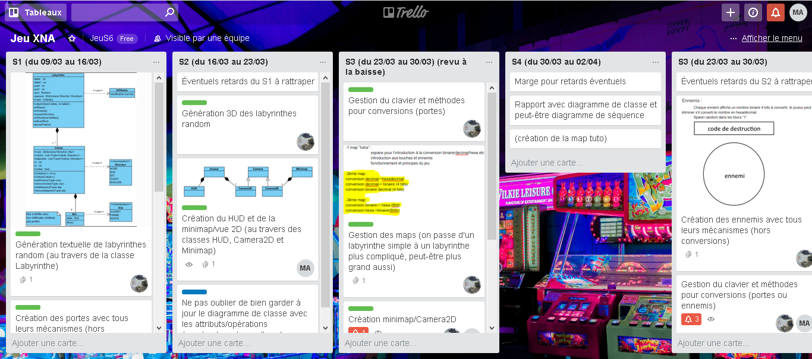

Nous nous donnions des feedbacks réguliers en rapport avec l’avancé du projet. 

Pour ce projet, nous avons organisé notre idée, développé le diagramme de classe initial et mis à jour celui-ci pendant toute la durée du projet, en faisant des tests entre chaque implémentation d’une nouvelle classe. 

* * *
**b) Réflexion développement**

**Pour chaque aspect du projet, nous avons établit la nature des éléments à implémenter : **

### **-****HUD : **

Concernant le HUD , le joueur peut voir :

**-L’état de ses points de vie : **

La vie du joueur est symbolisée ici par une barre de vie, mais nous avons préféré un total de point de vie pour ne pas encombrer la vue du joueur. 

**-Le temps restant : **

Un timer de 3 minutes s’affiche en début de jeu, le joueur a donc 3 minutes pour arrivé du point de départ au point d’arrivée. 

**-Le type de conversion qu’il doit effectuer : **

Chaque code à convertir est choisi aléatoirement; ainsi que le type (type, format)

-Le nombre à convertir : Parmis une "liste" de nombre **binaire/hexadecimal/decimal, **selon le type de conversion,** un nombre s'affiche sur le HUD** du joueur : 

	**-si le joueur se trouve devant une porte**

**-si le joueur se trouve devant un ennemi**

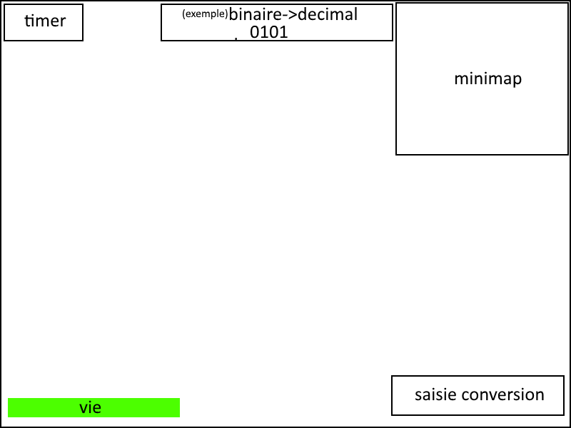

### **-Ennemis :**

Nous n’avons malheureusement pas pu implémenter les ennemis et l’AI, faute de temps, cependant nous avions réfléchi à leur comportement, avatar et comment le joueur interagit avec : 

-Nous avions un objet 3D pour représenter les ennemis : 

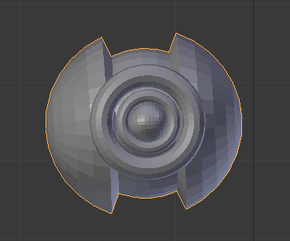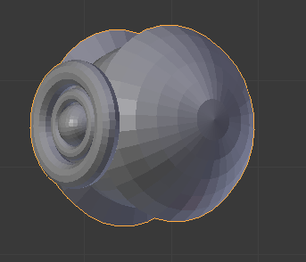

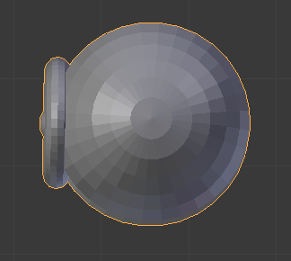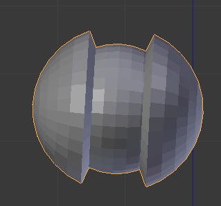

-Chaque ennemi affiche un nombre binaire 4 bits à convertir : 

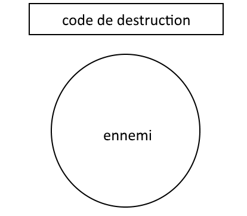

-L’ennemi se serait déplacé avec un "panel" portant son code à convertir.

-Le joueur peut les éliminer s’il converti le nombre en hexadécimal. 

-Leur comportement serait déterminé par l’algorithme A* et un Spawn random (comme les labyrinthes sont parfaits, les ennemis ne peuvent pas être coincés entre 4 murs).

* * *

## II-Partie Détails code : Les labyrinthes :

	Nous avons fait le choix de générer aléatoirement des labyrinthes selon plusieurs critères:

* **tailleL** : nombre de lignes du labyrinthe

* **tailleC** : nombre de colonnes du labyrinthe

* **nbPortes** : nombre de portes dans le labyrinthe

* **nbChoixConv** : nombre de types de conversions différentes disponibles dans le niveau (pour les portes)

### a) La classe Labyrinthe

Cette classe permet de générer aléatoirement un labyrinthe selon les paramètres expliqués ci-dessus. Une fois le constructeur appelé, tout est généré (mais rien n’est dessiné). Nous nous sommes aidé de ce site [http://weblog.jamisbuck.org/2010/12/27/maze-generation-recursive-backtracking](http://weblog.jamisbuck.org/2010/12/27/maze-generation-recursive-backtracking) pour comprendre un des algorithmes de génération de labyrinthes parfaits qu’est le recursive backtracking. 

* * *

### b)La classe Laby_Dessins_Collisions

	

Au départ, le contenu de cette classe était entièrement dans la classe Labyrinthe puis nous avons décidé de la séparer en deux. Nous avons donc d’un côté la génération et de l’autre le dessin puis la gestion des collisions.

Pour le dessin et les collisions, nous nous sommes aidé de [https://the-eye.eu/public/Books/IT%20Various/xna_4_3d_game_development_by_example.pdf](https://the-eye.eu/public/Books/IT%20Various/xna_4_3d_game_development_by_example.pdf) au chapitre 3.

La gestion des collisions évite au joueur de passer à travers les murs fermés/portes.

* * *

### c) La classe Mur

Le labyrinthe est constitué de cellules comportant 4 murs. 

De manières aléatoires, un mur peut : 

**-être ouvert**

**-être fermé **

**-être une porte**

Un mur qui n’est pas fermé et n’est pas une porte est à l’état "ouvert".

Lorsque le joueur ouvre une porte, le mur passe de l’état "porte" à l’état “ouvert”. 

Un mur qui n’est ni une porte et n’est ni ouvert est à l’état "fermé". 

**Concernant le système de conversion; une conversion est générée aléatoirement, il y a affichage du nombre à convertir, et le type de conversion : **

**Pour débloquer une porte, il faut être dans un des blocs adjacents à celle-ci.**

Les conversions numériques que le joueur doit pouvoir résoudre sont :

• Passage d’un nombre décimal en binaire (sur 4 et 8 bits)

• Passage d’un nombre binaire en décimal (sur 4 et 8 bits)

• Passage d’un nombre binaire en hexadécimal (sur 8 bits)

• Passage d’un nombre hexadécimal en binaire (sur 8 bits)

• Passage d’un nombre décimal en hexadécimal

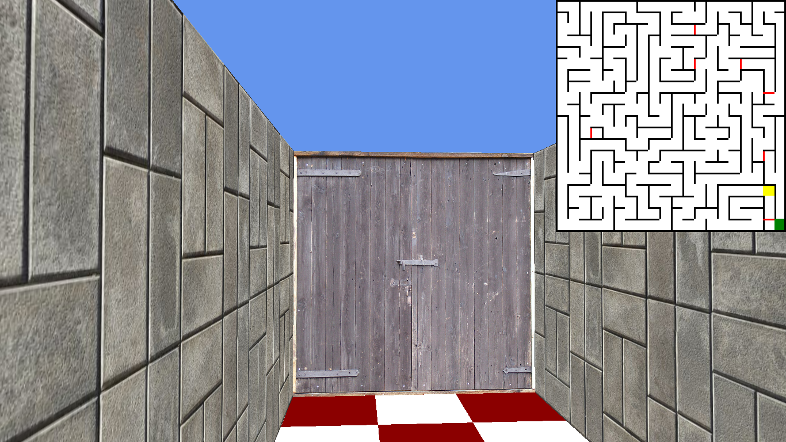

**Exemple de conversion : **

**Il y a affichage du type de conversion à effectuer "Type de conversion"; et le chiffre à convertir “Conversion à saisir” **

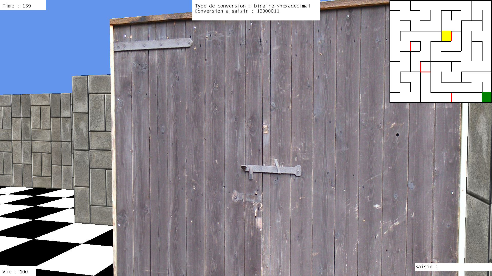

En bas à droite, le joueur peut voir le nombre qu’il saisit au clavier.

La saisie au clavier est gérée dans Game1. Il y a un "mode de saisie" qui s’active quand on maintient la touche “Espace” appuyée. En reprenant l’exemple ci-dessus, le code binaire étant 10000011, le joueur doit donc pour ouvrir la porte maintenir Espace appuyé puis écrire “83” pour convertir le code binaire en hexadécimal. Pour effacer le code tapé il faut appuyer sur “R” et si le joueur veut supprimer seulement le dernier caractère alors il doit appuyer sur “Espace” + “Effacer” (touche au-dessus de “Entrée”). 

Pour les chiffres, le pavé numérique fonctionne ainsi que les touches au-dessus des lettres pour les joueurs ne possédant pas de pavé numérique. Les lettres vont de A à F.

Petite difficulté rencontrée :

Lors de la génération automatique des types de conversion et des codes pour les portes, nous avons dû implémenter un Random en static car tous les codes de toutes les portes étaient les mêmes dû au fait que la génération du labyrinthe (et donc des portes) prenait un temps de calcul infime. Le random étant basé sur le temps d'exécution du programme, il générait presque toujours la même chose. 

* * *

d) La classe Cellule

### 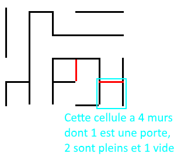

**A noter que nous avons "préparé le terrain" pour l’implémentation de l’IA en créant et maintenant une liste d’adjacence propre à chaque Cellule qui donne les cellules voisines accessibles (donc sans mur fermé/porte). *** * *

### e) La classe Floor

La classe Floor représente le sol du labyrinthe, sa texture est gérée via une fonction donnant automatiquement le motif alternant 2 couleurs données en paramètre en s’ajustant à la taille totale du labyrinthe grâce à des autres paramètres de taille. 

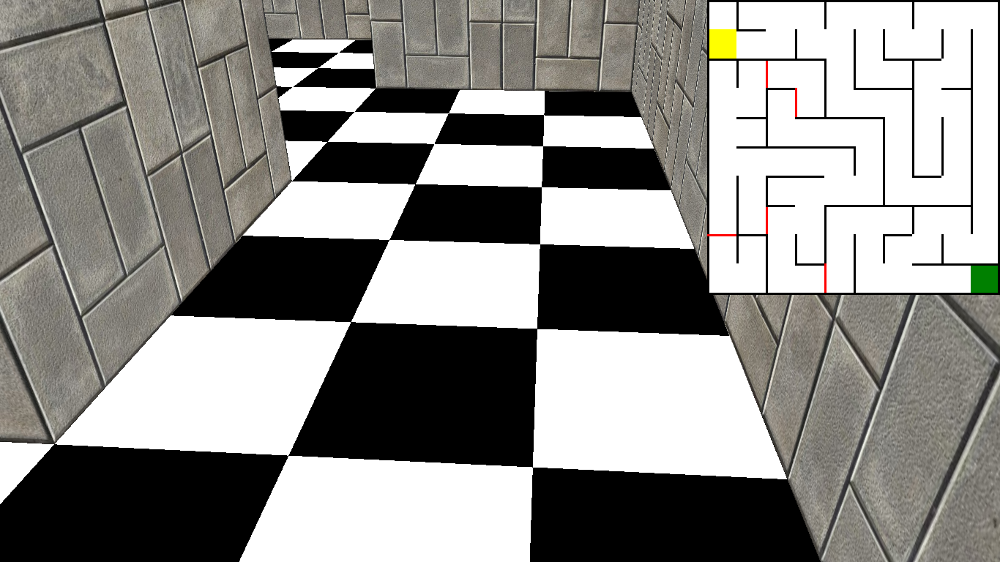

### * * *

### f) La classe Camera3D

La camera est la vision du joueur (vue FPS) : 

Nous avons ajusté la caméra pour qu’il n’y ai aucun lags , que la minimap reste fixe et que le joueur puisse se déplacer via les touches : 

**-z : déplacement avant**

**-s : déplacement arrière**

**-q: déplacement à gauche**

**-d : déplacement à droite**

*(il y a également des "cheats" pour voir la labyrinthe d’en haut (ou d’en bas) en appuyant sur “p” et “m”)*

**Également, l’orientation de la caméra3D s’adapte via les mouvements sur le pad ou déplacement souris. **

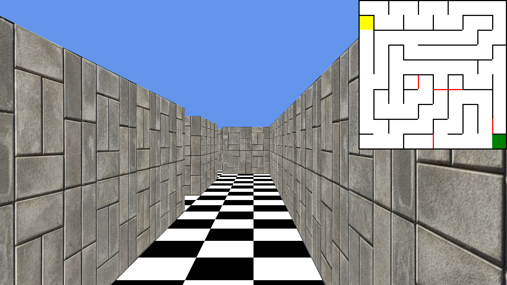* * *

### g)La classe Objet3D

Cette classe gère le cube que nous avons assigné à la "fin" du labyrinthe.

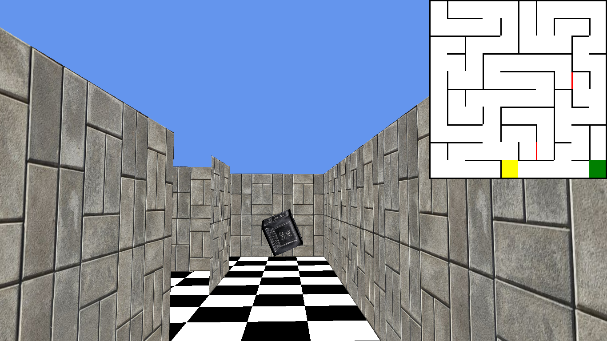

* * *

### h)La classe Cube3DTex

Quand le joueur est au point d’arrivée du labyrinthe, il a accès au changement automatique de map via ce cube qui émet une rotation.

Le cube n’est qu’une façon de montrer visuellement qu’on est à la fin. Dans la classe Game1 on connaît l’emplacement du joueur grâce à la variable **celluleCourante** et si on arrive à la même position que le cube (donc en bas à droite), le changement de map s’effectue.

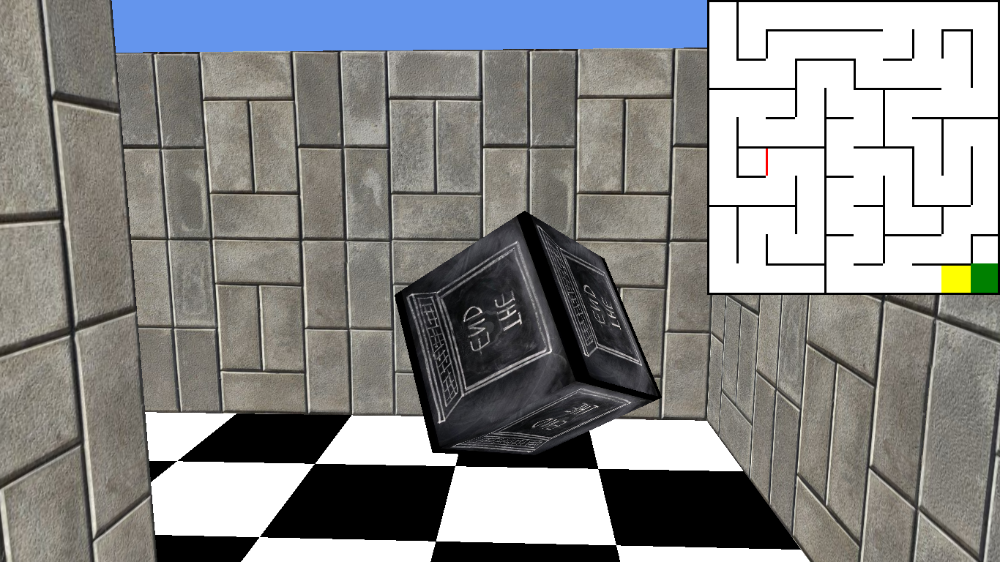

### Au contact du cube, on passe de la map 1 à la map 2 : 

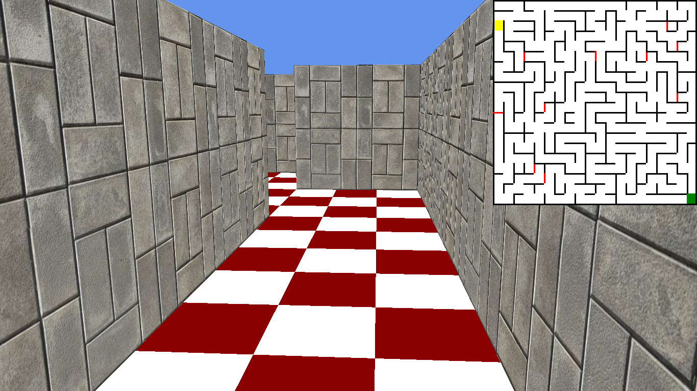

La map2 correspond à un changement de niveau : Il y a plus de portes, plus de types de conversion disponibles, le labyrinthe est plus grand et le visuel du sol est différent. 

* * *

### i) La classe Minimap : 

Nous avons décidé de représenter la minimap en entier : 

**-Le point de départ est en haut à gauche**

**-Le joueur( ou plutôt la cellule courante, la cellule dans laquelle le joueur se trouve)  est représenté en jaune**.

 La minimap se met directement à jour quand le joueur se déplace, le joueur peut ainsi voir sa progression et s’orienter. 

**-Les murs sont représentés en traits noirs**

**-Les portes sont représentées en traits rouges**

**-Le point d’arrivée est représenté en vert. **

La minimap s’adapte directement à la taille du labyrinthe puisque nous avons changé juste l’apparence du labyrinthe et comment le joueur est représenté dans le jeu. 

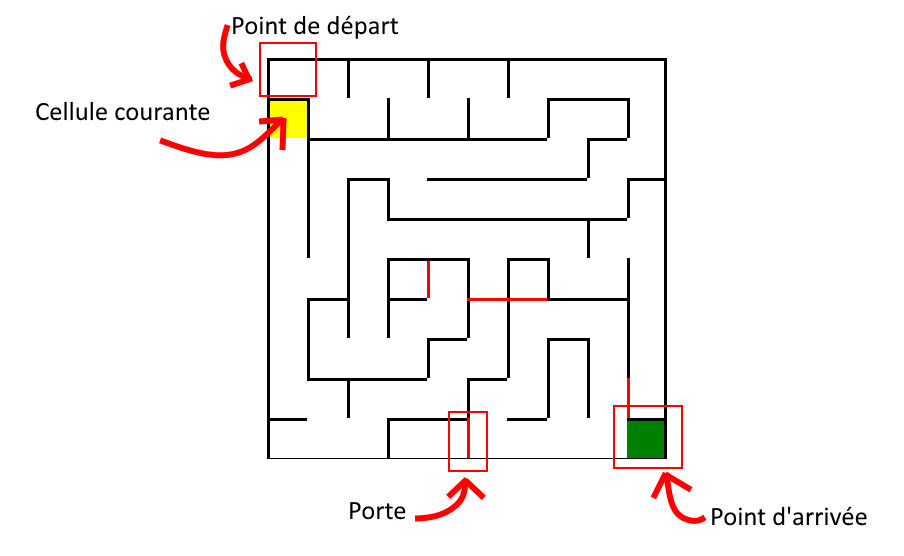

* * *

### j) La classe HUD : 

Le HUD se charge de l’affichage des différents éléments : La vie, le nombre à convertir ainsi que le type de conversion demandée et le timer. 

-Le timer figure en haut à gauche : 180 secondes, soit 3 minutes.

-L’affichage Conversion se place en haut

-La minimap à été réduite, et se place en haut à droite. 

-La saisie au clavier s’affiche en bas à droite.

-Le nombre de point de vie du joueur (max = 100) s’affiche en bas à gauche. 

### * * *

### k) La classe Game1 : 

La classe Game1 permet : 

**-La génération de l’interface du jeu**

**-L’affichage du HUD **

**-La mise à jour des attributs (prise dégâts/ baisse de vie, augmentation de vie, conversion réussie, ouverture d’une porte, changement de map, génération d’un labyrinthe)**

* * *

* * *

### III- Diagramme de classe complet

Vous pourrez le retrouver dans le dossier "Diagramme_de_classe" fournit avec le rapport et le code.

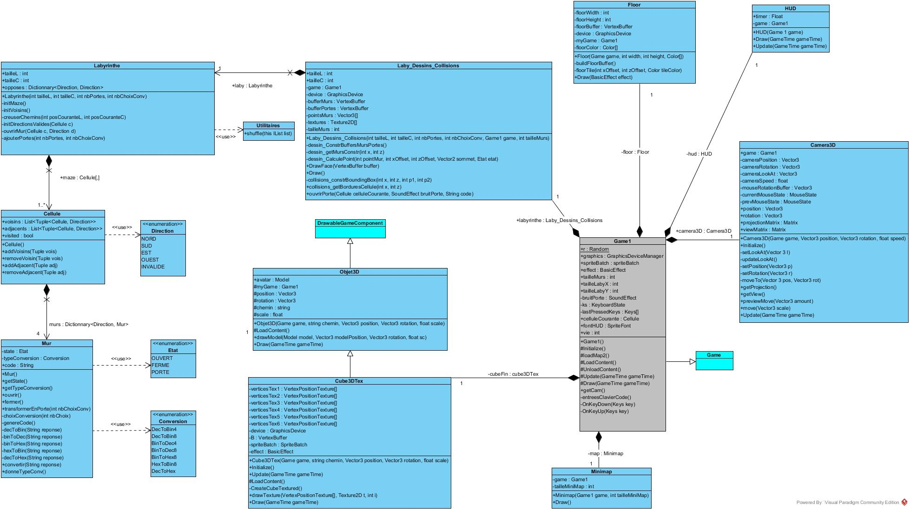

